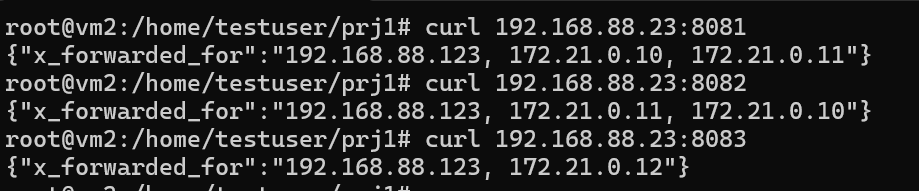
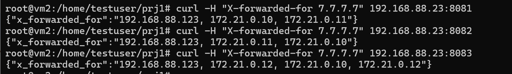

# variables
В ТЗ не указанно как именно запрос должен приходить на инстансы nginx, поэтому мы будем пробивать их просто по порту устройства на которой они развернуты. 

Ниже преведены все переменные используемые в тестах
## stable
```
nginx1: 172.21.0.10 | 8081
nginx2: 172.21.0.11 | 8082
nginx3: 172.21.0.12 | 8083
```
## dynamic
```
host: 192.168.88.23
user: 192.168.88.123
```
# curl 


# curl с подменой заголовка



